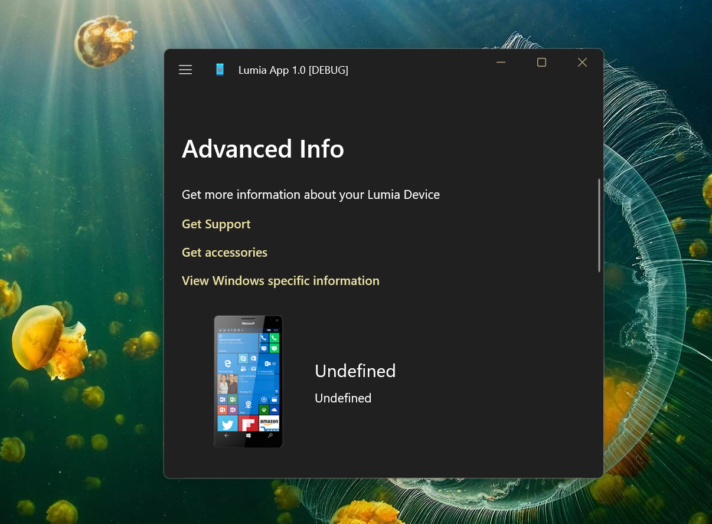

# Lumia Settings Application (LumiaApp) 
This repository is Lumia Settings App prototype (draft, sketch). 
(the original source code for the Lumia Settings application shipped as part of the LumiaWOA project). 
This is my try to run Lumia Settings app on my Windows 10 Mobile "smart device".
Please note: this is only technology prototype, resolt of my micro-RnD. 

# Description
Meta is a simple application (proto) to run and RnD "Meta" (old name is "Facebook") site on your Windows 10 Mobile device... 
A custom User Agent is set, so Meta web app (FB's group) is able to load on mobile. 
There are a few bugs present on the W10 Mobile platform, but some modes are ok! =)))  

## Screenshots

## Known issues
- Some XAML incompatibility with Win10Mobile build 15063. But this code runs on Win11... 
- Magisk package/lib was temporaty disabled because of some .NET Standard 1.6 problems :)

## Installation

No binaris/execs. DIY!

For developers:
- Install [Visual Studio 2019](https://developer.microsoft.com/en-us/windows/downloads).

- Install the "Universal Windows Platform Development" workload.

- Install the Windows 10 SDK build 15063.

- Clone the code repository.

- Open [MetaUWP.sln](/MetaUWP.sln) with Visual Studio.

# Contribute!
There's still a TON of things missing from this proof-of-concept (MVP) and areas of improvement 

With best wishes,

  [m][e] 2021

## Thanks!
I wanted to put down some thank you's here for folks/projects/websites that were invaluable 
for helping me get this project into a functional state:
- [Gustave Monce](https://github.com/gus33000/) - Great C# developer
- [WOA Project](https://github.com/WOA-Project/) - Windows on ARM project

LumiaApp 1.0 is RnD project only. AS-IS. No support. Distributed under the MIT License.  
        
